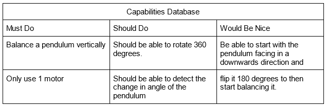

# MECA 482-01 
  
##  Furuta Pendulum Project
  
####  By: William Jochum, Alex Lawhon, Brendan Ruddy, Ceara Sobecki, Anthony Van Boekel
-----------------------------------------------------------------------------------------
## Table of Contents
- [1. Introduction](#1-Introduction)
- [2. Control System Design](#2-Control_System_Design)
- [3. Mathmatical Modeling](#3-Mathmatical_Modeling)
- [4. Simulation](#4-Simulation)
- [5. Presentation](#5-Presentation)
- [6. Refrences](#6-Refrences)

-----------------------------------------------------------------------------------------
## 1. Introduction

A classic control system example, that demonstrates the understanding for nonlinear controls laws, is the Furuta Pendulum.
The format used, to display this project, was CoppeliaSim and Matlab. The pendulum system which rotates freely on a vertical plane, is attached to a driven arm that rotates in a horizontal plane. When the pendulum is placed in the upright position, the actuator rotating the supporting arm will keep it balanced and upright. 

  

-----------------------------------------------------------------------------------------
## 2. Control_System_Design

insert text here

  

insert text here

  

-----------------------------------------------------------------------------------------
## 3. Mathmatical_Modeling

insert text here
 [code](MECA_482_Project_Code.m) 
 insert text here
 
  In Hernandez-Guzman et. al [1], the derivation of the mathematical model is described in greater detail and provides clarification for each step.

-----------------------------------------------------------------------------------------
## 4. Simulation

The virtual reality environment program Coppelia Sim allows the user to model in 3D space and simulate that model in real life dynamic simulation. The model can be programmed using Python or a proprietary programming language “lua”. Lua is a similar language to MATLAB that utilizes conditional statements to execute various movements in the 3D space. The program can also be linked to MATLAB to allow users to utilize MATLAB’s language, which allows for a broader spectrum of users. 

The user can connect the two programs using a specific set of  files that are included with the download of Coppelia Sim. Within the Coppelia Sim program files, there are four files (remApi.m, remoteApi.dll, remoteApiProto.m, simpleTest.m) that must be grouped together in one folder in order to connect MATLAB and Coppelia Sim. These [files](/Files) are listed and can be downloaded from the “Files” section. Once these files are collected, the sampleTest.m file must be opened in MATLAB and the instructions listed must be followed in order to guarantee a successful connection of the two programs. 

Once a successful connection is achieved, the lua code that will execute the motion of the pendulum inside Coppelia Sim, must be added to the designated block within the MATLAB program. However, after extensive research, utilizing numerous online resources, textbooks and Coppelia Sim forums, creating a complex lua program such as this was unsuccessful. Gaining a full understanding of the required language was not feasible in the allotted time period. Therefore, the results of the simulation were not successful in achieving a self balanced pendulum.

  

Although the simulation was unsuccessful, the parameters were acquired and the dynamics of the system that were derived. Illustrated in figure above, the pendulum is swung about the y-axis creating the angle θ_1. This angle is interpreted by the origin joint, and depending on the value of θ_1, the joint rotates in order to keep θ_1 within specified values. 

The furuta pendulum has long slender arms, giving the moment of inertia along the axis of its arm to be negligible. The arms also have rotational symmetry, which creates the moment of inertia of the two principal axes to be equal. 

  

<iframe src="Images/Furuta Pendulum Sim.mp4" width="640" height="480" allow="autoplay"> </iframe>

-----------------------------------------------------------------------------------------
## 6. Refrences
 
 [1] Hernandez-Guzman, V. M., & Silva-Ortizoga, R. (2019). Chapter 16. In Automatic Control with Experiments (pp. 921–950). essay, Springer.
